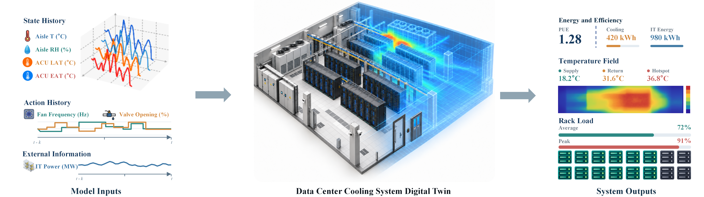

# BOREAS: Action-Conditioned World Modeling for Data Center Cooling Systems

  <b>A learning-based digital twin for recursive simulation of data-center cooling dynamics under control actions and IT workloads.</b>

  <a href="https://huggingface.co/datasets/Fine6868/BOREAS"><b>Dataset</b></a>
  &nbsp;|&nbsp;

  

## Overview

**BOREAS** is an action-conditioned world model for data-center cooling systems. It learns controlled thermal dynamics directly from operational telemetry and recursively predicts future thermal states under specified cooling-control and IT-workload sequences.

The model is designed around three challenges in real-world cooling-system modeling:

- **Heterogeneous spatial interactions:** temperature/humidity sensors and air-conditioning units (ACUs) have different physical roles and feature spaces.
- **History dependence:** partially observed thermal dynamics depend on recent operating history, control actions, and workload conditions.
- **Action-response learning:** strong thermal inertia can make a predictor rely on past temperatures while underusing control information.

BOREAS addresses these challenges with a **Heterogeneous-Entity Thermal Interaction Encoder**, a **Recurrent Thermal-Context Updater**, a probabilistic **Thermal-Dynamics Transition Model**, and an auxiliary **Inverse-Dynamics Representation Regularization (IDRR)** objective.

## Motivation

Evaluating cooling strategies directly in a production data center can be costly and risky. A learned digital twin provides a way to model how thermal states evolve under control inputs before actions are deployed in the physical system.

  

The released operational dataset contains synchronized thermal observations, cooling-control signals, and IT workloads collected from a real-world data-center cooling system. After data cleaning, the study uses **64,825 valid state transitions** sampled at **5-minute intervals**.

## Method

BOREAS separates thermal-state estimation from action-conditioned transition prediction.

### 1. Spatiotemporal Thermal Context Encoding

At each time step, sensors and ACUs are represented as heterogeneous entities. Because explicit sensor-to-ACU adjacency is facility-specific, BOREAS does not prescribe a fixed graph topology. Instead, it applies **global self-attention across all entities** to learn interactions within and across entity types.

A **Recurrent Thermal-Context Updater (GRU)** then integrates:

- the current heterogeneous-entity thermal representation,
- the exogenous IT-workload embedding,
- the preceding control action, and
- the previous recurrent thermal context.

The resulting latent state summarizes the current operating condition together with relevant thermal history.

### 2. Probabilistic Controlled Thermal-Dynamics Prediction

Conditioned on the current thermal context, the candidate control action, and the concurrent IT workload, BOREAS predicts a distribution over the **next observation increment** rather than directly predicting the absolute next state.

The predicted increment is added to the current observation to obtain the next thermal state, which can then be recursively fed back into the model for multi-step rollout.

### 3. Inverse-Dynamics Representation Regularization

To strengthen sensitivity to control actions, BOREAS introduces a training-only inverse-dynamics objective. The auxiliary head reconstructs control changes from the pre-intervention thermal context and the subsequent observation representation.

This regularization encourages the learned state representation to preserve action-response information instead of explaining transitions primarily through thermal inertia.

## Dataset

The experiments use operational data collected from a production data center in Guangdong Province, China, from **January 1 to December 11, 2025**.

| Item | Description |
|---|---|
| Sampling interval | 5 minutes |
| Valid state transitions | 64,825 |
| Predicted thermal variables | 46 channels |
| Cooling equipment | 9 ACUs |
| Equipment-status signals | 9 |
| Fan/valve control signals | 18 |
| IT-load signals | 8 |
| Data split | Chronological train/validation/test, approximately 7:1:2 |

Dataset: **https://huggingface.co/datasets/Fine6868/BOREAS**

## Experimental Results

BOREAS is evaluated against classical dynamics models and deep time-series forecasting baselines, including OLS-ARX, Ridge-ARX, DMDc, Subspace-SS, Kalman-SS, Informer, TSMixer, TimesNet, and LightTS.

The main evaluation metric is **channel-standardized pooled RMSE (cs-pRMSE)**, which normalizes prediction errors using training-set channel scales before pooling across variables and rollout steps.

| Forecast horizon | Physical horizon | BOREAS cs-pRMSE |
|---:|---:|---:|
| 1 step | 5 min | **0.2145** |
| 5 steps | 25 min | **0.4179** |
| 10 steps | 50 min | **0.4605** |
| 15 steps | 75 min | **0.4970** |

At the 5-minute horizon, BOREAS reduces cs-pRMSE by **16.4%** relative to the strongest dynamics baseline and **17.3%** relative to the strongest time-series baseline reported in the paper. At 75 minutes, the corresponding reductions are **26.0%** and **23.8%**.

The recursive-rollout experiments initialize all methods with the same observation history, feed predicted observations back as subsequent inputs, and provide the recorded control inputs and IT-load trajectories at future steps.

## Ablation Findings

The ablation study shows that the major components contribute in complementary ways:

- Removing **IDRR** increases cs-pRMSE increasingly with horizon, from **1.4%** at one step to **7.3%** at 15 steps.
- Replacing the **Recurrent Thermal-Context Updater** with a memoryless mapping produces a larger long-horizon degradation, reaching **14.2%** at 15 steps.
- Replacing the **Heterogeneous-Entity Thermal Interaction Encoder** with a flat MLP increases cs-pRMSE by approximately **4.3%-5.9%** across the evaluated horizons.

## Hyperparameter Sensitivity

  

The paper studies the depth and width of the heterogeneous-entity encoder, recurrent-state dimension, attention-head count, and transition-model width/depth. The adopted configuration uses a **64-dimensional heterogeneous-entity encoder**, a **256-dimensional recurrent thermal context**, and a **five-member ensemble**.

## Scope and Limitations

The current evaluation is based on operational data from a **single facility**. Recursive experiments use **recorded future control inputs and IT-load trajectories**, so they primarily evaluate recursive state propagation along observed operating trajectories.

Accordingly, the current experiments do **not** establish reliable counterfactual accuracy for arbitrary, experimentally unvalidated action sequences, nor do they directly demonstrate post-deployment energy savings. Deployment decisions involving thermal safety or equipment limits still require facility-specific constraints, expert review, and independent safety mechanisms.

